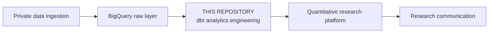
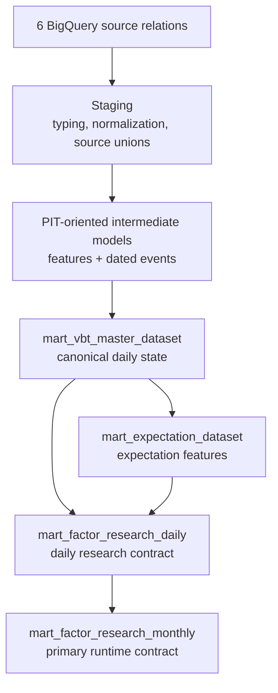

# Taiwan Equity Analytics Engineering

Transform raw Taiwan equity market and financial data into point-in-time-oriented, research-ready analytical datasets.

## What this repository does

Raw prices, monthly revenue, quarterly statements, and corporate actions cannot be joined safely by ticker and reporting period alone. They have different grains, become observable at different times, and may use different per-share bases before and after a corporate action.

This dbt project turns six BigQuery source relations into coherent daily and monthly research datasets. It models assumed information availability, aligns financial events to market dates, preserves source-period lineage, reconciles split-sensitive per-share measures, and keeps formation-date characteristics separate from future return labels.

## Platform role



This repository owns warehouse transformations and analytical contracts. It does not implement the private ingestion jobs, cloud orchestration, or the downstream research application.

## Architecture



The four current analytical contracts are:

- `mart_vbt_master_dataset`: reusable daily market and fundamental state;
- `mart_expectation_dataset`: forward-fundamental and market-implied expectation features;
- `mart_factor_research_daily`: canonical daily research panel; and
- `mart_factor_research_monthly`: primary formation-date and next-rebalance contract consumed by the research platform.

See [Architecture](docs/architecture.md) for the complete DAG and model classifications.

## Key engineering decisions

- Financial information enters market time on explicit policy dates and retains its source-period and aligned-date lineage.
- Revenue, income-statement, and balance-sheet snapshots are forward-filled as whole structs, preventing values from different source observations from being mixed field by field.
- `effective_close` is the contemporaneous price level used for valuation; adjusted `adj_close`/`d_close` is reserved for return continuity and scale-invariant technical features.
- Cumulative EPS subtraction reconciles reporting bases only across corporate actions between the two reporting-period ends.
- Separate corporate-action events transition already-known per-share state on the effective date.
- Monthly return labels join to the exact next scheduled rebalance date rather than skipping missing months with a ticker-level `LEAD`.
- Automated correctness tests are complemented by human-readable, warehouse-backed diagnostic analyses.

## Point-in-time semantics

The project is **point-in-time-oriented**, not universally PIT-safe. Where actual historical publication timestamps are unavailable, monthly and quarterly data use documented policy-based availability dates and align to the next market date.

The implementation distinguishes accounting period, assumed availability date, aligned market date, and corporate-action effective date. Details, including exact quarterly policies and corporate-action basis transitions, are in [Point-in-time semantics](docs/point_in_time_semantics.md).

## Data contracts

The declared upstream relations are:

- `daily_prices_partitioned`
- `monthly_revenue`
- `income_statement`
- `balance_sheet`
- `sii_dividend`
- `otc_dividend`

The source YAML currently contracts relation names, not complete column-level schemas or source freshness. The important downstream contracts are the master, expectation, daily research, and monthly research marts listed above.

See [Data contracts](docs/data_contracts.md) for required fields, expected grains, units that can be inferred from code, and assumptions that are not yet enforced.

## Validation

The repository separates two kinds of evidence:

```text
tests/      automated correctness contracts
analyses/   human-readable warehouse-backed diagnostics
```

Current validation includes:

- 12 generic dbt tests for canonical mart keys and uniqueness;
- 10 singular dbt tests for PIT boundaries, identities, returns, and corporate-action diagnostics;
- 11 warehouse-free Python fixtures for EPS and adjusted-price boundaries; and
- 3 curated corporate-action analyses covering action availability, generic EPS diagnostics, and one end-to-end case study.

Yageo / 國巨 `2327` is currently the only usable equity corporate-action case validated end to end. It is evidence for the implemented mechanism, not proof of universal source-restatement behavior.

## Quickstart

Python 3.11 is used by the container image. Install the pinned dbt dependencies in an isolated environment:

```bash
python3 -m venv .venv
source .venv/bin/activate
python -m pip install -r requirements.txt
```

Warehouse-free correctness fixtures:

```bash
python3 -m unittest discover \
  -s tests \
  -p 'test_research_correctness_fixtures.py' \
  -v
```

Project dependency and structural checks:

```bash
dbt deps --profiles-dir .
dbt parse --profiles-dir . --target dev
dbt ls --profiles-dir . --target dev
```

`dbt compile` may require adapter authentication or warehouse metadata access depending on the environment:

```bash
dbt compile --profiles-dir . --target dev
```

`dbt show`, `dbt test`, `dbt run`, and `dbt build` execute BigQuery queries or materializations. They require Google Application Default Credentials plus compatible source relations. Production raw data and credentials are not distributed with this repository. The checked-in profile contains environment-specific identifiers for the current deployment and should be adapted for another project.

The container entry point runs `dbt deps` followed by `dbt build`; it is therefore a warehouse-executing workflow, not an offline validation command.

## Repository structure

```text
models/      source, staging, intermediate, and mart transformations
tests/       dbt data tests and warehouse-free correctness fixtures
analyses/    curated diagnostic and empirical validation queries
docs/        architecture, contracts, and temporal semantics
seeds/       manual corporate-action inputs
```

## Canonical and legacy models

Current contracts:

- `mart_vbt_master_dataset`
- `mart_expectation_dataset`
- `mart_factor_research_daily`
- `mart_factor_research_monthly`

Legacy compatibility models:

- `mart_vbt_valuation_dataset`
- `mart_factor_dataset`

The legacy marts are retained for earlier research workflows. They are not substitutes for the current daily or monthly research contracts; in particular, the older valuation path uses adjusted `d_close` as an absolute valuation price.

`vbt` is a historical internal naming convention in this project; no expansion is asserted. In current models, `d_close` is the propagated name for adjusted `adj_close`, while `effective_close` is the contemporaneous price-level field.

## Known limitations

- Financial availability uses policy dates rather than complete historical publication timestamps.
- Immutable filing versions are not retained; explicitly re-fetching a historical quarter can replace the source basis previously observed.
- Shares outstanding are inferred from financial-statement fields rather than treated as authoritative exchange-reported counts.
- Manual corporate-action coverage and checked-in provenance are limited.
- Only `2327` currently provides usable end-to-end equity corporate-action validation.
- Source and staging grain enforcement is incomplete, particularly for balance-sheet ticker-quarter rows.
- Production upstream data is private and is not distributed with this repository.

## Documentation

- [Architecture](docs/architecture.md)
- [Data contracts](docs/data_contracts.md)
- [Point-in-time semantics](docs/point_in_time_semantics.md)
- [Corporate-action coverage analysis](analyses/corporate_action_coverage.sql)
- [Generic corporate-action EPS validation](analyses/corporate_action_eps_validation.sql)
- [Yageo 2327 corporate-action case study](analyses/yageo_2327_corporate_action_case_study.sql)
