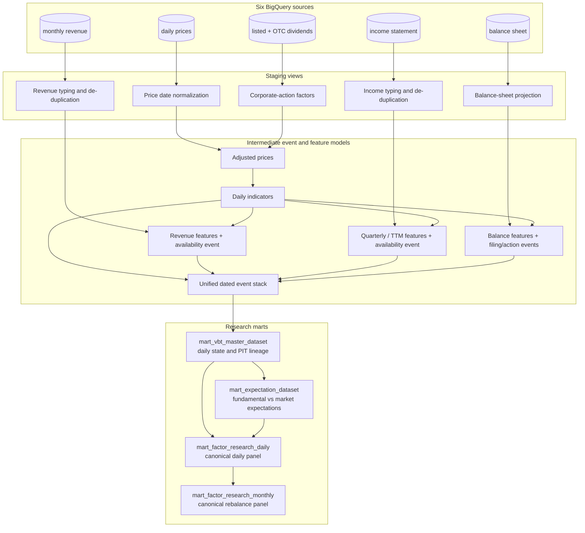

# Taiwan Equity Analytics Engineering

Transform raw Taiwan equity market and financial data into reproducible, point-in-time-oriented analytical datasets for quantitative research.

This dbt project is the transformation layer of a broader research platform. It standardizes six ingestion tables, models disclosure availability and corporate actions, aligns fundamentals to trading dates, and publishes daily and monthly research contracts consumed by a Streamlit application.

The design is intentionally candid: several strong point-in-time controls are implemented, but assumed disclosure dates and parts of the adjusted-price/EPS logic still require review before the entire warehouse can be described as point-in-time safe.

## Platform role


The diagram represents the application and data flow. This repository includes a container entry point for dbt, but it does not contain complete Scheduler, Pub/Sub, Cloud Run, IAM, or monitoring infrastructure definitions.

## The analytical-engineering problem

Quantitative research needs more than cleaned columns. The inputs arrive at different grains and become knowable at different times:

- prices are daily, while revenue is monthly and financial statements are quarterly;
- listed and OTC corporate actions must be reconciled with historical price series;
- cumulative statements must be converted into single-quarter and trailing-period features;
- disclosure periods must not appear on trading dates before their assumed availability;
- fundamentals must be carried forward as coherent snapshots rather than field-by-field mixtures; and
- formation-date characteristics must remain separate from future return labels.

dbt makes those temporal and analytical choices visible as lineage instead of embedding them inside a dashboard or notebook.

## Actual model architecture



Separate DCF support dimensions and older valuation/factor marts branch from the master dataset but are not the canonical Streamlit contracts.

## Upstream raw-data contract

The source declaration currently contains the same six table names written by the private ingestion layer:

| Source table | Staging model | Domain |
| --- | --- | --- |
| `daily_prices_partitioned` | `stg_daily_prices_raw` | Daily OHLCV |
| `monthly_revenue` | `stg_monthly_revenue` | Monthly company revenue |
| `income_statement` | `stg_income_statement` | Quarterly performance |
| `balance_sheet` | `stg_balance_sheet` | Quarterly financial position |
| `sii_dividend` | `stg_dividend_factor` | Listed-market corporate actions |
| `otc_dividend` | `stg_dividend_factor` | OTC corporate actions |

This is a confirmed table-name contract. Source freshness, source-level tests, and formal dbt model contracts are not currently defined.

## Point-in-time design

| Mechanism | Current assessment | What the SQL does |
| --- | --- | --- |
| Monthly revenue availability | **REVIEW** | Assigns an assumed date on the 11th of the following month and aligns it to the first available market date |
| Quarterly statement availability | **REVIEW** | Maps quarters to conservative assumed deadlines, then aligns them to market dates; actual historical announcement timestamps are unavailable |
| Fundamental propagation | **PASS** | Unions dated events and forward-fills whole revenue, income, and balance-sheet structs so values retain their lineage together |
| Balance-sheet corporate actions | **PASS / REVIEW** | Applies split-sensitive transitions only from their effective date, but completeness depends on a small manual seed |
| Market capitalization | **PASS** | Uses contemporaneous effective close multiplied by contemporaneous shares outstanding, not a future-adjusted price |
| Monthly return label | **PASS** | Joins to the exact next scheduled rebalance date instead of using a ticker-level `LEAD` that could skip missing months |
| Adjusted prices and EPS | **RISK** | Reverse cumulative price factors and future corporate-action EPS adjustments need economic and event-date validation before blanket PIT claims |
| Legacy valuation mart | **RISK** | Uses adjusted close as an absolute P/E price input; the canonical master and expectation paths use the contemporaneous price field instead |

PIT lineage fields—including source period, assumed deadline, and aligned market date—are retained in the master and research marts so downstream analysis can audit information timing.

## Model layers

| Layer | Materialization and responsibility |
| --- | --- |
| Sources | Six declared BigQuery raw tables in `stock_data` |
| Staging | Views for type normalization, source union, and selected de-duplication |
| Intermediate | Views plus one partitioned adjusted-price table; feature calculation and dated availability events |
| Core mart | Partitioned `mart_vbt_master_dataset`, keyed and tested by `date + ticker` |
| Expectation marts | DCF lookup dimensions, rolling revenue expectations, forward fundamentals, and implied-growth comparison |
| Research marts | Partitioned daily and monthly panels with explicit formation characteristics, PIT lineage, and return labels |

## Research-ready datasets

| Model | Grain | Role | Classification |
| --- | --- | --- | --- |
| `mart_vbt_master_dataset` | `date + ticker` | Reusable daily state combining prices, indicators, and forward-filled fundamental snapshots | Canonical reusable core |
| `mart_expectation_dataset` | `date + ticker` | Fundamental growth expectations, DCF-implied growth, and expectation-gap signals | Reusable specialized mart |
| `mart_factor_research_daily` | `date + ticker` | Daily returns, benchmark return, characteristics, denominators, size, and PIT lineage | Canonical research contract |
| `mart_factor_research_monthly` | `rebalance_date + ticker` | Monthly formation panel with exact next-rebalance stock and benchmark returns | Canonical Streamlit contract |
| `mart_factor_dataset` | `date + ticker` | Broad factor export mixing master and older valuation features | Legacy/overlapping terminal mart |
| `mart_vbt_valuation_dataset` | `date + ticker` | Multi-horizon implied-growth lookup using the older price convention | Legacy/overlapping valuation mart |
| `dim_dcf_surface`, `dim_dcf_lookup` | Parameter grid / rounded P/E key | Deterministic DCF support tables | Reusable supporting dimensions |

Read-only inspection of the downstream application confirms that it queries `mart_factor_research_daily` and `mart_factor_research_monthly`; its contract checks explicitly reject the older master, factor, and expectation marts as runtime substitutes.

## Data quality and testing

The project currently parses 21 dbt tests:

- 12 generic tests: non-null keys and four composite uniqueness contracts;
- nine singular tests covering master-key duplication, future dates, negative volume, three PIT-alignment checks, market-cap identity, daily stock returns, and benchmark returns.

This is meaningful mart-level coverage, but testing is not yet comprehensive. Important gaps include source freshness, source/staging key tests, valid OHLC relationships, period-format tests, consecutive-quarter checks, duplicate dividend factors, deadline-versus-row-date assertions, corporate-action boundary tests, adjusted-return fixtures, expectation bounds, and primary-key tests for legacy/supporting marts. There are no snapshots, enforced model contracts, relationships tests, accepted-values tests, or custom project generic-test macros.

Runtime SQL filters and research statistics are not counted as dbt tests.

## Reproducibility and runtime

- dbt Core and the BigQuery adapter are pinned in `requirements.txt`.
- `dbt_utils` is pinned through `packages.yml` and `package-lock.yml`.
- Models use `source()` and `ref()` lineage rather than hard-coded table references inside analytical SQL.
- Large daily marts are materialized as BigQuery tables with date partitioning and ticker clustering where configured.
- `Dockerfile` and `run_dbt.sh` provide a container execution path; the script runs `dbt deps` followed by the query-bearing `dbt build` command.

`dbt parse` and `dbt ls` complete locally when target and log output are redirected outside the project. In this environment, `dbt compile` attempted OAuth token access, so it should not be treated as a guaranteed offline check. `dbt build`, `dbt run`, and `dbt test` execute BigQuery work and should only be run against an intentionally selected environment.

The checked-in profile currently uses OAuth/ADC-style authentication and contains environment-specific project, dataset, and region values—not stored credentials. Those identifiers and the hard-coded source database should be parameterized before public release.

## Repository structure

```text
models/sources/       BigQuery source contract
models/staging/       source typing, union, and de-duplication
models/intermediate/  price adjustment, features, availability events, event stack
models/marts/core/    reusable daily master dataset
models/marts/expectation/  expectation and implied-growth datasets
models/marts/research/     canonical Streamlit research contracts
tests/                singular data-quality and PIT checks
seeds/                manual corporate-action exceptions
```

## Known limitations

- Disclosure availability uses policy dates rather than historical announcement timestamps; income and balance-sheet Q2 assumptions currently differ by one day.
- Historical EPS is adjusted with future corporate-action factors and is used downstream, which requires PIT remediation or an explicitly non-PIT label.
- The dividend reverse-cumulative adjustment appears to include the event-date factor and lacks a small fixture-based economic test.
- The older valuation mart uses adjusted close as an absolute price-level input.
- The manual corporate-action seed contains only two exceptions and has no checked-in provenance documentation.
- Staging de-duplication is not consistently based on ingestion timestamps; monthly revenue currently keeps the greatest revenue value for duplicate month/ticker rows.
- Environment-specific identifiers remain in `profiles.yml` and the source declaration.
- Benchmark ticker and DCF assumptions are embedded in SQL rather than exposed as dbt variables.
- Complete deployment infrastructure, source freshness, and warehouse DDL are outside this repository.

## Related platform components

- **Data ingestion:** private production implementation; public architecture is documented in the platform landing repository.
- **Quantitative research:** Streamlit application consuming the daily and monthly research contracts; public link pending.
- **Research publication:** bilingual research blog and featured case study; public link pending.
