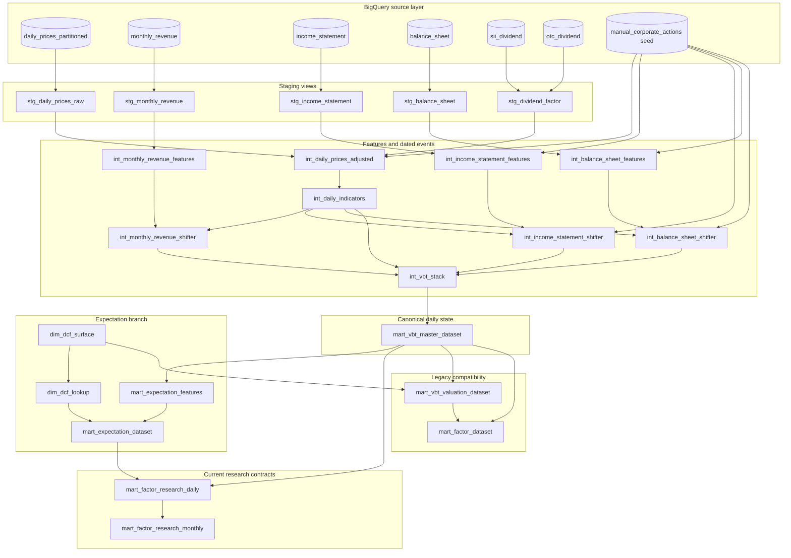

# Architecture

This repository is the analytics-engineering layer of a larger Taiwan equity research platform. Its responsibility is to transform raw warehouse relations into documented, point-in-time-oriented daily and monthly analytical contracts.

## Platform boundary

```text
Private ingestion → BigQuery raw relations → this dbt project → research application → publication
```

- The private ingestion layer retrieves and loads market, revenue, statement, and dividend data. Its orchestration and infrastructure are outside this repository.
- This repository owns source declarations, data normalization, temporal alignment, feature derivation, event-state construction, and research marts.
- The downstream quantitative research platform directly consumes `mart_factor_research_daily` and, primarily, `mart_factor_research_monthly`.

No deployment, IAM, scheduler, or ingestion-orchestration claims are made here.

## Source layer

[`models/sources/stock_sources.yml`](../models/sources/stock_sources.yml) declares six BigQuery relations:

- `daily_prices_partitioned`
- `monthly_revenue`
- `income_statement`
- `balance_sheet`
- `sii_dividend`
- `otc_dividend`

The declaration currently identifies relations only. It does not enforce source columns, freshness, or key uniqueness. See [Data contracts](data_contracts.md) for the fields inferred from current model usage.

## Staging layer

Staging models are views that isolate raw-source conventions from downstream transformations.

| Model | Responsibility |
|---|---|
| `stg_daily_prices_raw` | Normalize supported date encodings while preserving the source price columns. |
| `stg_monthly_revenue` | Cast revenue fields and select one row per ticker and revenue month using the current greatest-revenue policy. |
| `stg_income_statement` | Cast financial fields and select one row per ticker and quarter using the current source-order policy. |
| `stg_balance_sheet` | Project the balance-sheet fields used downstream; ticker-quarter uniqueness is currently expected but not enforced. |
| `stg_dividend_factor` | Union listed and OTC events, derive positive price factors, and fail duplicate valid ticker/ex-date factors. |

The duplicate policies are not substitutes for immutable filing versions. In particular, the current sources do not expose reliable filing-version or ingestion-version metadata to this project.

## Intermediate layer

The intermediate layer separates two responsibilities.

### Feature models

Feature models derive economic or accounting measures in source/reporting-period space:

- `int_daily_prices_adjusted` derives contemporaneous and adjusted price fields.
- `int_daily_indicators` derives moving averages, bias, and amplitude.
- `int_monthly_revenue_features` derives growth streak and trend signals.
- `int_income_statement_features` converts cumulative statements into quarter and TTM measures and reconciles per-share reporting bases.
- `int_balance_sheet_features` derives ratios, inferred shares, contemporaneous per-share fields, and separately labeled normalized diagnostics.

### Shifter and event models

Shifter models determine when a feature snapshot becomes observable in market time:

- `int_monthly_revenue_shifter`
- `int_income_statement_shifter`
- `int_balance_sheet_shifter`

Each creates dated event rows with source-period, policy-deadline, and market-alignment lineage. Income and balance shifters also create corporate-action events that transition already-known per-share state on an action's effective date.

This distinction is intentional: feature models answer “what does this report mean on a compatible reporting basis?” while shifters answer “when may the market-time state use it?”

## Unified daily state

`int_vbt_stack` unions four event families into a common dated schema:

1. daily market observations;
2. monthly revenue availability events;
3. income-statement filing/action events; and
4. balance-sheet filing/action events.

`mart_vbt_master_dataset` groups coincident ticker/date events and forward-fills complete revenue, income, and balance-sheet structs. Forward-filling the struct rather than each scalar independently keeps a value attached to the source period and availability metadata that produced it.

The master then exposes:

- raw, effective, and adjusted price fields;
- technical indicators;
- current revenue, income, and balance state;
- source-period and availability lineage;
- contemporaneous P/E and P/B; and
- row-horizon adjusted-price returns retained for older workflows.

`vbt` is a historical internal naming convention. The repository does not provide a reliable expansion, so none is asserted in the public documentation.

## Expectation branch

The expectation branch combines recent revenue trends, financial statement state, and a deterministic DCF lookup.

```text
mart_vbt_master_dataset → mart_expectation_features ─┐
                                                     ├→ mart_expectation_dataset
dim_dcf_surface → dim_dcf_lookup ────────────────────┘
```

- `mart_expectation_features` reduces forward-filled revenue to one observation per source month, computes rolling revenue-growth features, and estimates forward revenue, income, and EPS from explicit formulas.
- `dim_dcf_surface` builds a parameter grid of implied P/E values.
- `dim_dcf_lookup` maps rounded observed P/E values to the closest grid result.
- `mart_expectation_dataset` compares a model-derived forward fundamental growth estimate with a market-implied growth estimate.

The embedded discount, terminal-growth, horizon, and clipping choices are research assumptions. They are not presented as objective forecasts or universal valuation rules.

## Research marts

`mart_factor_research_daily` combines the master state with expectation features. It publishes daily adjusted-price returns, benchmark returns, research characteristics, valuation fields, market capitalization, denominator diagnostics, and PIT lineage.

`mart_factor_research_monthly` creates the research formation panel:

- the rebalance date is the first `0050` market date on or after the 15th of each month;
- characteristics come from that exact formation date;
- the next date is derived from the common rebalance calendar; and
- stock and benchmark labels use prices on that exact next rebalance date.

The monthly mart is the primary downstream runtime contract. The daily mart is also consumed for daily and beta-oriented research.

## Canonical and legacy models

| Classification | Models | Meaning |
|---|---|---|
| Canonical reusable core | `mart_vbt_master_dataset` | Daily coherent state and lineage. |
| Canonical specialized mart | `mart_expectation_dataset` | Expectation and implied-growth features used by the daily research mart. |
| Canonical research contracts | `mart_factor_research_daily`, `mart_factor_research_monthly` | Current downstream application interfaces. |
| Legacy compatibility | `mart_vbt_valuation_dataset`, `mart_factor_dataset` | Earlier research paths retained for compatibility; not substitutes for current contracts. |

The legacy valuation path derives absolute P/E from adjusted `d_close`. Current canonical valuation fields instead use contemporaneous `effective_close`.

## Materialization and BigQuery design

Staging, shifter, feature, and event-stack models are generally views. The main adjusted-price and mart datasets are tables.

The following large dated tables are partitioned by month and clustered by ticker:

- `int_daily_prices_adjusted` on `date`;
- `mart_vbt_master_dataset` on `date`;
- `mart_expectation_dataset` on `date`;
- `mart_factor_dataset` on `date`;
- `mart_factor_research_daily` on `date`; and
- `mart_factor_research_monthly` on `rebalance_date`.

`dim_dcf_surface`, `dim_dcf_lookup`, and the legacy `mart_vbt_valuation_dataset` are unpartitioned tables. These are practical BigQuery choices for the present project, not a claim of comprehensive warehouse-performance engineering.

## Full DAG



For the temporal rules behind this DAG, see [Point-in-time semantics](point_in_time_semantics.md).
